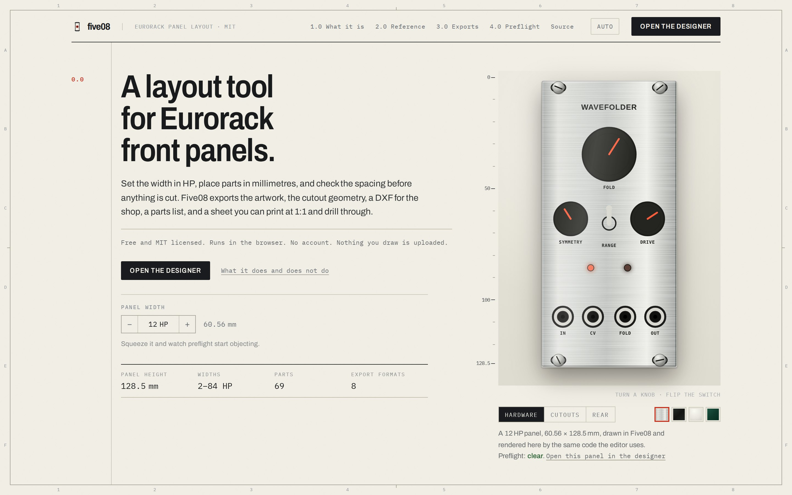
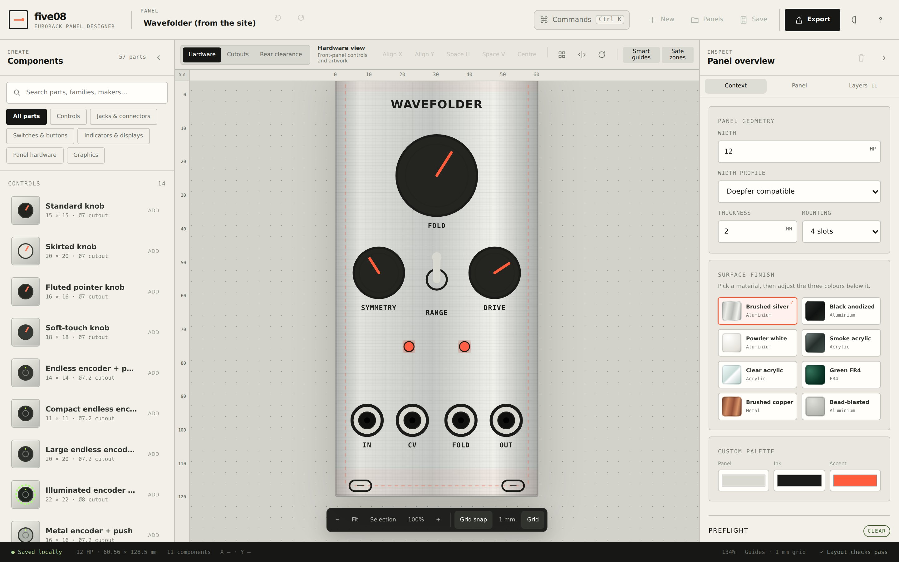

# Five08

[](https://github.com/alibros/five08/actions/workflows/ci.yml)
[](LICENSE)

Five08 is a free, open-source layout tool for Eurorack front panels. Set the width in HP, place parts in millimetres, check the spacing, and export the files a fabricator — or your own drill press — needs.

It runs entirely in the browser. There is no account, no server, and no upload. Projects live in browser storage until you export them, and the app works offline once it has been opened.



## What it does

- **Real Eurorack geometry.** 128.5 mm tall; nominal HP widths, the Doepfer allowance, or a custom width in millimetres.
- **A parts library.** Knobs, encoders, illuminated buttons, jacks, sliders, switches, displays, LEDs, mounting hardware, text, shapes and imported artwork. All physical components keep their catalog dimensions; size presets select another real part rather than stretch the current one.
- **Millimetre placement.** Grid snapping, centre and edge guides, live neighbour distances, equal-gap detection, alignment, distribution, spreading and grid arrangement.
- **Direct manipulation.** Drag, rubber-band select, resize, rotate, mirror, flip, lock, hide, reorder, duplicate, copy and paste — with undo throughout.
- **Four views of the same layout.** Hardware, machining cutouts, mirrored rear clearance and orbitable 3D inspection, plus rack context. All 53 controls, connectors and indicators have detailed front-facing 3D models with distinct finishes. The back shows panel openings without speculative connector bodies. Panel thickness and openings use the same millimetre geometry as the exports; cap heights remain illustrative.
- **Groups, arrays and assemblies.** Repeat a channel strip, or save it as a reusable assembly with portable JSON import/export. Copies have independent group IDs.
- **Panel typography.** Panel-wide font, weight, legend size, case and inverted output labels, with individual text overrides. Scale graphics have configurable start, sweep, tick count, major ticks, length and line weight.
- **Panel previews.** Aluminium, acrylic, FR4, copper, powder-coated and bead-blasted finishes.
- **Preflight.** Machining, assembly, ergonomics and artwork categories. Configure wall/edge clearance, jack pitch, available rear depth, knob finger clearance and minimum text size. Click an issue to select and frame the parts.
- **A project library.** Named projects, autosave, recovery snapshots and portable project files.
- **Traceable dimensions.** Every part says whether its figures came from a datasheet or a guess, and links to the source.
- **Keyboard operable.** The canvas is a listbox: skip links, Tab between parts, arrow keys to place them.



## Exports

| Format | Contents |
| --- | --- |
| Artwork SVG | Physical-size panel artwork, including embedded PNG graphics |
| Cutout SVG | Panel outline, mounting slots, holes and component apertures |
| Cutout DXF | R12, millimetres, layered `PANEL_OUTLINE` / `MOUNTING` / `CUTOUTS` / `ENGRAVING` |
| KiCad mechanical PCB | KiCad 7+ `.kicad_pcb`, exact `Edge.Cuts` outline and openings, including true slot arcs and panel thickness; no artwork, electrical footprints or circuitry |
| PNG | 150–1200 dpi raster render |
| Print at 1:1 | A paper drilling template at actual size |
| VCV Rack SVG | Artwork with component-role helper markers |
| BOM CSV | Quantities, part names, cutouts, rear depths and whether a dimension is generic |
| `.panel.json` | Editable Five08 project |

Cutout SVG, DXF, KiCad and 3D inspection share `src/geometry.ts`. Artwork SVG excludes rendered knobs, jacks and other physical hardware; PNG retains the hardware preview. Hidden objects do not contribute to the BOM or VCV helper markers. SVG text remains editable: outline it in a vector editor before fabrication or use with VCV's SVG tooling.

See [the studio workflow](docs/studio-workflow.md) for assemblies, styles, rules and inspection, and [the research roadmap](docs/research-roadmap.md) for the rationale and remaining work.

## Use it locally

Requires Node.js 22 or newer and a current browser. 3D inspection requires WebGL 2 and downloads its rendering code on first use; open it online once before relying on it offline.

```bash
git clone https://github.com/alibros/five08.git
cd five08
npm install
npm run dev
```

Vite prints the local URL. The public page is at `/`; the designer is at `/app/`.

The homepage uses an editable 20 HP example panel. Its live 3D, flat panel and rack views share `src/demo.ts`; **Edit this panel** creates a new project without replacing existing work. Hardware retains catalogue dimensions when the example is narrowed. `public/halo-showcase.webp` is a lightweight render of that same model for first paint and browsers without WebGL.

## Keyboard and pointer controls

| Action | Control |
| --- | --- |
| All commands | `Cmd/Ctrl` + `K` |
| Find a part | `/` |
| Move | Drag a component |
| Free movement, ignoring the grid | `Alt` + drag |
| Rubber-band select | Drag empty canvas |
| Add to selection | `Shift` + click |
| Pan | `Space` + drag, or middle-button drag |
| Zoom at the pointer | `Cmd/Ctrl` + scroll |
| Fit panel / zoom to selection | `0` / `F` |
| Resize artwork | Drag a selection-box corner; hardware uses standard-size presets |
| Preserve aspect ratio | `Shift` + resize |
| Nudge by the grid step | Arrow key |
| Nudge 1 mm | `Shift` + arrow key |
| Rotate 90° | `R` / `Shift` + `R` |
| Mirror across the centreline | `M` |
| Lock or unlock | `L` |
| Copy / cut / paste | `Cmd/Ctrl` + `C` / `X` / `V` |
| Duplicate | `Cmd/Ctrl` + `D` |
| Select all | `Cmd/Ctrl` + `A` |
| Undo / redo | `Cmd/Ctrl` + `Z` / `Cmd/Ctrl` + `Shift` + `Z` |
| Your panels / Save / Export / Print | `Cmd/Ctrl` + `O` / `S` / `E` / `P` |

## Project storage and privacy

Projects, assemblies, recovery snapshots and preferences are stored in your browser. Five08 does not upload projects or artwork. Copy and paste puts component JSON on the system clipboard so you can move parts between tabs; it is validated on the way back in. Assemblies have separate `.assembly.json` backups and are not included in a project's backup.

Use **Save** to download a portable project before clearing browser data or moving to another computer. Artwork is embedded in the project file, and individual images are limited to 1.5 MB to keep browser persistence practical. Imported SVG is stripped to a presentational subset — scripts, event handlers, `foreignObject`, animation and external references are removed — both on import and again whenever a project is opened, because an exported SVG is a live document if someone opens it directly in a browser.

## Fabrication warning

Five08 is a layout and planning tool, not a substitute for manufacturer drawings. Generic component dimensions are useful starting points, but they are not certified mechanical specifications. Verify every cutout, tolerance, mounting point, material thickness and fabrication process against the actual component datasheet before manufacturing a panel.

Preflight catches layout mistakes. It cannot catch a wrong dimension.

## Development

```bash
npm run verify        # typecheck, unit tests, build, browser tests
```

Or individually:

```bash
npm run typecheck
npm test              # unit tests for the pure modules
npm run build
npm run test:e2e      # the built app in a real browser (needs: npx playwright install chromium)
```

The production build is written to `dist/`. The repository uses a Vite multi-page build:

- `index.html` — public page
- `app/index.html` — designer

Brand titles use self-hosted Chakra Petch Medium; the header and social wordmarks are outlined from the same font. `npm run assets:brand` regenerates those SVGs with equal side margins and copies the font's SIL Open Font License to `public/chakra-petch-OFL.txt`.

### Source layout

| File | Responsibility |
| --- | --- |
| `src/model.ts` | Project and component types, project parsing and sanitisation |
| `src/catalog.ts` | The parts library |
| `src/geometry.ts` | Cutout and mounting geometry, shared by every exporter |
| `src/svg.ts` | Component and panel rendering |
| `src/dxf.ts` | DXF R12 writer |
| `src/kicad.ts` | Mechanical KiCad board writer |
| `src/inspect3d.ts` | On-demand Three.js inspection and resource disposal |
| `src/hardware3d.ts` | Physical-footprint component models, shared materials and mesh batching |
| `src/assemblies.ts`, `src/assembly-dialog.ts` | Validated reusable selections, storage and library UI |
| `src/design.ts`, `src/studio-controls.ts` | Shared legend/scale geometry and panel-style/rule controls |
| `src/raster.ts` | PNG rendering and the 1:1 print sheet |
| `src/preflight.ts` | Layout checks |
| `src/arrange.ts` | Align, distribute, mirror, rotate and grid placement |
| `src/store.ts` | Browser-local project library, recovery snapshots, preferences |
| `src/palette.ts` | Command palette |
| `src/history.ts` | Undo history, budgeted by bytes rather than step count |
| `src/artwork.ts` | SVG import sanitiser |
| `src/main.ts` | The editor |
| `src/landing.ts`, `src/landing-hero.ts`, `src/demo.ts` | Public page, on-demand 3D showcase and editable HALO panel |

## Deploying to Vercel

Import the repository into Vercel and use the detected Vite settings. No environment variables or server functions are required. [`vercel.json`](vercel.json) adds the production security headers.

## Contributing

Bug reports and focused pull requests are welcome. See [CONTRIBUTING.md](CONTRIBUTING.md).

The most useful contribution is a traced dimension. [`docs/parts-wanted.md`](docs/parts-wanted.md)
lists the parts still running on estimates, and
[`.claude/skills/add-part/SKILL.md`](.claude/skills/add-part/SKILL.md) is the
procedure for tracing one to its datasheet and citing it.

Created by [Ali Bross](https://forestofrods.com).

Released under the [MIT License](LICENSE).
